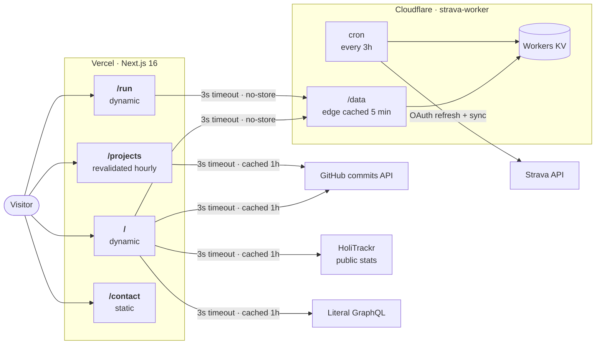

# Koda Allison — portfolio

My personal site: projects I have built, what I am doing now, live running data, and a bit of life away from the keyboard.

Live at **[koda-allison-portfolio.vercel.app](https://koda-allison-portfolio.vercel.app/)**.

The design is dark and borrows some visual language from developer tools, but it is not trying to look like a fake terminal.

## Architecture

The app is built with the Next.js App Router and deployed on Vercel. Most of the site is ordinary server-rendered content; the live sections read from four optional external sources. Each request has a three-second timeout, and the page has a useful fallback when a provider is unavailable.



### Why the Strava worker exists

The portfolio never talks to Strava directly. A separate Cloudflare Worker, [strava-worker](https://github.com/KodaAllison/strava-worker), refreshes the OAuth token, fetches activities on a cron, calculates the stats used by the site, and stores the result in Workers KV. The portfolio only reads its `/data` endpoint.

- **Secrets stay out of the portfolio.** Strava credentials and OAuth tokens live only in the Worker.
- **Renders stay quick.** The site reads one prepared KV-backed response instead of waiting on the slower, rate-limited Strava API.
- **Running data stays current.** `/` and `/run` use `cache: "no-store"`, while the Worker applies its own five-minute edge cache.

The other integrations are deliberately optional:

- GitHub activity comes from the commits API—not the delayed events feed—and is cached for an hour.
- HoliTrackr provides the countries and totals used by the travel globe. A checked-in snapshot is used if its endpoint is unavailable.
- Literal supplies the current and recently finished books when `LITERAL_PROFILE_HANDLE` is configured. The bookshelf disappears cleanly when it is not.
- `fetchWithTimeout` bounds every external request so one unavailable provider cannot hold the whole server render open.

## Pages

| Route | Rendering | What is there |
|---|---|---|
| `/` | Dynamic | Running trace, current role and timeline, recent projects, travel globe, bookshelf, and live-data colophon |
| `/projects` | Revalidated hourly | GitHub activity, current work including Koder, and archived projects |
| `/run` | Dynamic | Live weekly mileage, training history, and personal records against goals |
| `/contact` | Static | Copyable email address, social links, and CV |

## Featured projects

- **Koder** — a dependency-free kanban PWA with offline support, Deno KV sync, a terminal CLI, agent tooling, and signed GitHub webhooks.
- **SwiftPlan** — my dissertation project: a lesson-plan generator built after researching teachers' planning workflows and prompt-engineering techniques.
- **Strava Worker** — the Cloudflare Worker and KV pipeline that powers the live running data on this site.
- **HoliTrackr** — a full-stack travel tracker with an interactive map, trip timeline, journals, and authentication.

The complete list lives in [`src/data/projects.json`](src/data/projects.json).

## Tech stack

- [Next.js 16](https://nextjs.org/) App Router and React 18
- Node.js 24, pinned in [`.nvmrc`](.nvmrc)
- [Tailwind CSS](https://tailwindcss.com/) with a small custom token system
- D3 Geo and World Atlas data for the travel globe
- Node's built-in test runner
- [Vercel Analytics](https://vercel.com/docs/analytics)
- [Cloudflare Workers and KV](https://github.com/KodaAllison/strava-worker) for the Strava pipeline

## Running locally

```bash
git clone https://github.com/KodaAllison/portfolio-website
cd portfolio-website
nvm use
npm install
npm run dev
```

The main site works without environment variables. These integrations are optional:

| Variable | Purpose |
|---|---|
| `STRAVA_DATA_URL` | Overrides the strava-worker `/data` endpoint |
| `GITHUB_TOKEN` | Raises GitHub API rate limits for the commit heatmap |
| `HOLITRACKR_STATS_URL` | Overrides the HoliTrackr public-stats endpoint |
| `LITERAL_PROFILE_HANDLE` | Enables the bookshelf for a public Literal profile |

## Checks

```bash
npm run lint
npm test
npm run build
```

## Acknowledgements

The first version started from a [webdecoded tutorial](https://www.youtube.com/watch?v=Kb1f5bvF6f4s). The site has since been redesigned and rebuilt from the ground up.

## License

[MIT](LICENSE)
