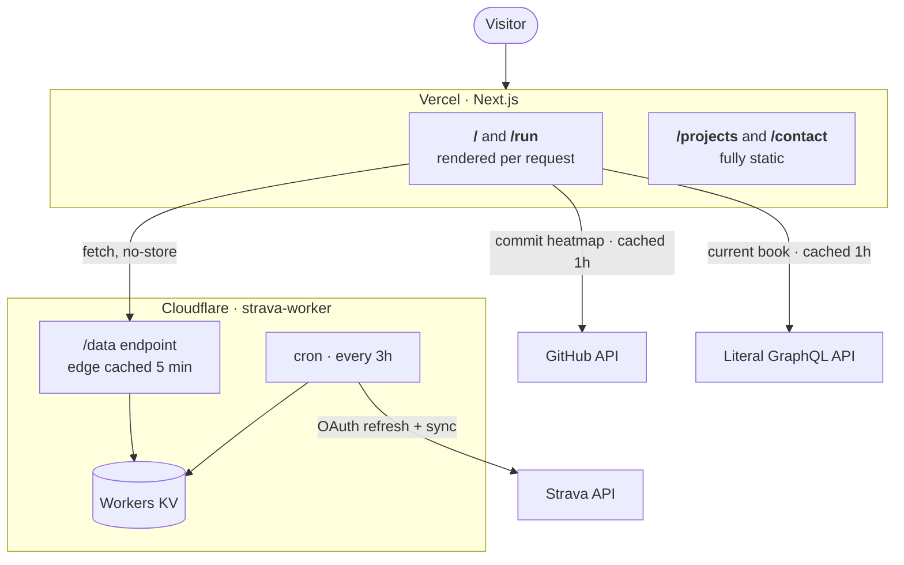

# portfolio_os v3

My personal site — projects, running stats, and a bit of me. Live at **[koda-allison-portfolio.vercel.app](https://koda-allison-portfolio.vercel.app/)**.

Built as a terminal-flavoured Next.js app: every page is styled like a dev tool — terminal windows, syntax-comment headings, status chips — because if I'm going to stare at editors all day, my site may as well look like one.

## Architecture

The interesting part is the running data pipeline. The site never talks to Strava directly — a separate Cloudflare Worker ([strava-worker](https://github.com/KodaAllison/strava-worker)) syncs from the Strava API on a cron, computes the stats blob (weekly km, PBs, streaks, activity log), and caches it in Workers KV. The portfolio just reads the Worker's `/data` endpoint on every request.



Why it's split this way:

- **No Strava secrets in the portfolio.** Strava's API is auth-only, and its OAuth tokens grant access to the whole account — so they live exclusively in the Worker. This repo builds and runs with zero required credentials; the only token it can use (`GITHUB_TOKEN`) is optional and used solely to read public data.
- **Fast renders.** Pages never wait on Strava's slow, rate-limited API — a render is a KV read behind a 5-minute edge cache.
- **Always fresh.** `/` and `/run` are server-rendered per request (`cache: "no-store"`), so visitors see the latest synced data rather than whatever was baked in at the last deploy. (Learned that one the hard way — ISR quietly served months-old stats to cold visitors on a low-traffic site.)

The GitHub commit heatmap on the home page takes the simple path: fetched from the GitHub events API and cached for an hour with `unstable_cache`.

## Pages

| Route | Rendering | What's there |
|---|---|---|
| `/` | dynamic | Intro, live weekly km, GitHub commit heatmap |
| `/projects` | static | Featured and archived projects |
| `/run` | dynamic | Live Strava stats — weekly chart, PBs vs goals, streaks |
| `/contact` | static | Click-to-copy email + socials. No form, no backend |

## Tech stack

- [Next.js 16](https://nextjs.org/) (App Router) + React 18
- [Tailwind CSS](https://tailwindcss.com/) with a custom terminal-inspired design system
- [Cloudflare Workers + KV](https://github.com/KodaAllison/strava-worker) for the Strava pipeline
- Deployed on [Vercel](https://vercel.com/) with Vercel Analytics

## Running locally

```bash
git clone https://github.com/KodaAllison/portfolio-website
cd portfolio-website
npm install
npm run dev
```

No env vars required. Three optional ones:

| Variable | Purpose |
|---|---|
| `STRAVA_DATA_URL` | Override the strava-worker `/data` URL (defaults to the live Worker) |
| `GITHUB_TOKEN` | Raises GitHub API rate limits and improves heatmap commit counts |
| `LITERAL_PROFILE_HANDLE` | Public Literal handle used for the currently-reading bookshelf; the module stays hidden when unset |

## Acknowledgements

The very first version started from a [webdecoded tutorial](https://www.youtube.com/watch?v=Kb1f5bvF6f4s) — it has since been redesigned and rebuilt from the ground up.

## License

[MIT](LICENSE)
